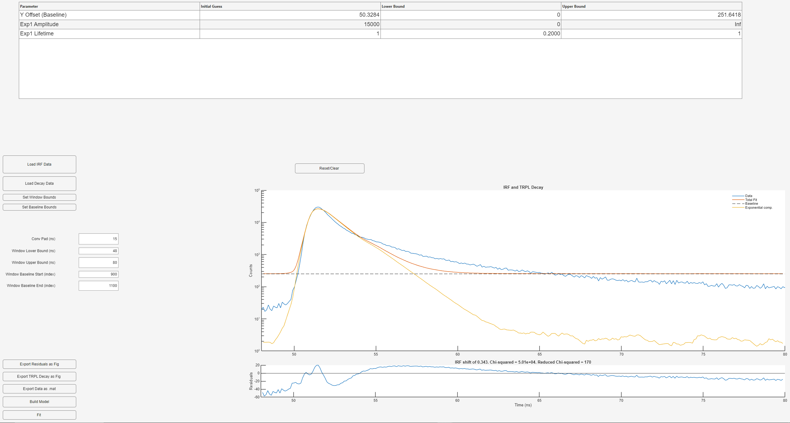

<div id="top"></div>

<!-- PROJECT SHIELDS -->
[![Contributors][contributors-shield]][contributors-url]
[![Forks][forks-shield]][forks-url]
[![Stargazers][stars-shield]][stars-url]
[![Issues][issues-shield]][issues-url]
[![BSD 3-Clause License][license-shield]][license-url]
[![LinkedIn][linkedin-shield]][linkedin-url]


<!-- PROJECT LOGO -->
<br />
<div align="center">
  <a href="https://github.com/SolarSpec/TRPL_Photos">
    
  </a>

<h3 align="center">Enhanced TRPL Fitting Tool</h3>

  <p align="center">
    An advanced MATLAB application for Time-Resolved Photoluminescence (TRPL) data analysis with interactive controls and flexible model building
    <br />
    <a href="https://github.com/SolarSpec/ScriptsAndFunctions"><strong>Explore the docs »</strong></a>
    <br />
    <br />
    <a href="https://github.com/SolarSpec/ScriptsAndFunctions">View Demo</a>
    ·
    <a href="https://github.com/SolarSpec/ScriptsAndFunctions/issues/new?labels=bug&template=bug_report.md">Report Bug</a>
    ·
    <a href="https://github.com/SolarSpec/ScriptsAndFunctions/issues/new?labels=enhancement&template=feature_request.md">Request Feature</a>
  </p>
</div>


<!-- TABLE OF CONTENTS -->
<details>
  <summary>Table of Contents</summary>
  <ol>
    <li>
      <a href="#about-the-project">About The Project</a>
      <ul>
        <li><a href="#built-with">Built With</a></li>
      </ul>
    </li>
    <li>
      <a href="#getting-started">Getting Started</a>
      <ul>
        <li><a href="#prerequisites">Prerequisites</a></li>
        <li><a href="#installation">Installation</a></li>
      </ul>
    </li>
    <li><a href="#usage">Usage</a></li>
    <li><a href="#roadmap">Roadmap</a></li>
    <li><a href="#contributing">Contributing</a></li>
    <li><a href="#license">License</a></li>
    <li><a href="#contact">Contact</a></li>
    <li><a href="#acknowledgments">Acknowledgments</a></li>
  </ol>
</details>


<!-- ABOUT THE PROJECT -->
# About The Project



This enhanced MATLAB application revolutionizes Time-Resolved Photoluminescence (TRPL) data analysis by providing an intuitive and powerful tool featuring:
- Interactive data loading with intelligent column selection
- Dynamic model building with customizable component combinations
- Real-time interactive range selection for fitting windows and baseline regions
- Advanced parameter validation and table-based parameter management
- Generalized fitting algorithms supporting arbitrary kinetic model combinations
- Professional data visualization with log-scale plotting and component breakdown
- Comprehensive export capabilities for both plots and numerical data
- Robust error handling and user feedback systems

<p align="right">(<a href="#top">back to top</a>)</p>


### Built With

* [MATLAB](https://www.mathworks.com/products/matlab.html)
* [MATLAB App Designer](https://www.mathworks.com/products/matlab/app-designer.html)
* [Parallel Computing Toolbox](https://www.mathworks.com/products/parallel-computing.html)
* [Optimization Toolbox](https://www.mathworks.com/products/optimization.html)
* [Statistics and Machine Learning Toolbox](https://www.mathworks.com/products/statistics.html)

<p align="right">(<a href="#top">back to top</a>)</p>


<!-- GETTING STARTED -->
# Getting Started

To begin using this enhanced app, follow these simple steps to ensure you have the necessary prerequisites and proper installation.

### Prerequisites

1. MATLAB (R2021a or newer recommended for full App Designer support)
2. Required MATLAB Toolboxes:
   - Parallel Computing Toolbox
   - Optimization Toolbox
   - Statistics and Machine Learning Toolbox

### Installation

1. Clone the repository
   ```sh
   git clone https://github.com/SolarSpec/TRPL.git
   ```

2. Install the application in MATLAB
   ```
   Double-click the TRPL.mltbx file in the ScriptsAndFunctions directory
   ```

3. Access the app
   ```
   Navigate to the APPS tab in MATLAB
   Find the app under 'MY APPS'
   Add it to your favorites for quick access
   ```

<p align="right">(<a href="#top">back to top</a>)</p>


<!-- USAGE EXAMPLES -->
## Usage

### Basic Workflow

1. **Load IRF Data**
   - Click "Load IRF Data"
   - Select an Excel file containing your instrument response function
   - Choose appropriate columns for time (ns) and IRF amplitude from the dialog
   - The app automatically detects header rows and provides intelligent column selection
   - IRF curve will be displayed in the main plot area

2. **Load Decay Data**
   - Ensure IRF data is loaded first
   - Click "Load Decay Data"
   - Select Excel file containing your TRPL decay data
   - Choose time and decay data columns from the provided options
   - The app automatically interpolates data to match IRF time axis if needed
   - Both IRF and decay data will be overlaid on a log-scale plot

3. **Build Custom Kinetic Model**
   - Click "Build Model" to access the model builder
   - Specify number of components for each kinetic type:
     - Exponential components (with amplitude and lifetime parameters)
     - Power law components (with amplitude, onset, and alpha parameters)
     - Second-order kinetic components (with amplitude and kinetic parameters)
   - The app dynamically generates a parameter table with intelligent initial guesses

4. **Configure Fitting Parameters**
   - **Interactive Range Selection**: 
     - Toggle "Set Window Bounds" to interactively select fit window using draggable lines
     - Toggle "Set Baseline Bounds" to define baseline region with visual feedback
   - **Manual Parameter Entry**:
     - Conv Pad: Convolution padding in nanoseconds (default: 15)
     - Window bounds: Time range for fitting analysis
     - Baseline indices: Region for background estimation
   - **Parameter Table Management**:
     - Edit initial guesses, lower bounds, and upper bounds directly in the table
     - Built-in validation ensures parameter consistency and physical feasibility

5. **Execute Fitting Analysis**
   - Click "Fit" to begin the optimization process
   - The app performs:
     - Comprehensive parameter validation
     - Automatic parallel pool initialization
     - Data preprocessing and baseline correction
     - MultiStart global optimization with 50 starting points
     - Real-time progress monitoring
   - Results are displayed with:
     - Log-scale main plot showing data, total fit, and individual components
     - Linear-scale residual plot for fit quality assessment
     - Comprehensive fit statistics (χ², reduced χ², component contributions)

6. **Export and Documentation**
   - **Plot Export**: Choose from multiple formats (PDF, EMF, SVG, .fig) for publication-ready figures
   - **Data Export**: Save complete analysis results as .mat files including:
     - Original time series and measurement data
     - All fitting parameters and bounds
     - Optimized parameter values and uncertainties
     - Statistical metrics and component analysis
     - Complete model configuration

### Advanced Features

- **Dynamic Model Architecture**: Build models with any combination of:
  - Multiple exponential decay components
  - Power law kinetics for dispersive transport
  - Second-order recombination kinetics
  - Automatic baseline handling and IRF deconvolution

- **Interactive Analysis Tools**:
  - Real-time draggable range selection with visual feedback
  - Live parameter table editing with instant validation
  - Automatic data interpolation and time axis matching
  - Smart baseline estimation from user-defined regions

- **Robust Optimization Engine**:
  - Generalized fitting algorithms handle arbitrary model complexity
  - MultiStart optimization ensures global minimum detection
  - Parallel processing for enhanced computational efficiency
  - Comprehensive error handling and convergence diagnostics

- **Professional Visualization**:
  - Dual-axis plotting (log-scale main plot, linear residuals)
  - Individual component visualization with automatic legends
  - Interactive zoom and pan capabilities
  - Publication-ready export options

- **Data Integrity and Validation**:
  - Automatic header detection and column mapping
  - Parameter bound checking and consistency validation
  - Graceful error handling with informative user feedback
  - Automatic data preprocessing and quality checks

<p align="right">(<a href="#top">back to top</a>)</p>

<!-- ROADMAP -->
## Roadmap

* [X] Enhanced interactive data loading with intelligent column detection
* [X] Dynamic model building system for arbitrary kinetic combinations
* [X] Real-time interactive range selection with visual feedback
* [X] Comprehensive parameter validation and table management
* [X] Generalized fitting algorithms for flexible model architecture
* [X] Advanced parallel processing optimization
* [X] Professional multi-format export capabilities
* [X] Robust error handling and user feedback systems
* [ ] Batch processing capabilities for multiple datasets
* [ ] Advanced statistical analysis and uncertainty quantification
* [ ] Model comparison and selection tools
* [ ] Integration with spectroscopic database systems

See the [open issues](https://github.com/SolarSpec/TRPL_Photos/issues) for a full list of proposed features and known issues.

<p align="right">(<a href="#top">back to top</a>)</p>

<!-- CONTRIBUTING -->
## Contributing

Contributions are what make the open source community such an amazing place to learn, inspire, and create. Any contributions you make are **greatly appreciated**.

If you have a suggestion that would make this better, please fork the repo and create a pull request. You can also simply open an issue with the tag "enhancement".
Don't forget to give the project a star! Thanks again!

1. Fork the Project
2. Create your Feature Branch (`git checkout -b feature/AmazingFeature`)
3. Commit your Changes (`git commit -m 'Add some AmazingFeature'`)
4. Push to the Branch (`git push origin feature/AmazingFeature`)
5. Open a Pull Request

<p align="right">(<a href="#top">back to top</a>)</p>

<!-- LICENSE -->
## License

Distributed under the BSD 3-Clause License. See `LICENSE` for more information.

Please refer to the TDMS reader directory to view the accompanying [`license.txt`](https://github.com/SolarSpec/ScriptsAndFunctions/blob/main/Matlab%20TDMS%20reader/license.txt)

<p align="right">(<a href="#top">back to top</a>)</p>

<!-- CONTACT -->
## Contact

SolarSpec - [SolarSpec Website](https://solarspec.ok.ubc.ca/) - rsarke01@student.ubc.ca

Project Link: [https://github.com/SolarSpec/ScriptsAndFunctions](https://github.com/SolarSpec/ScriptsAndFunctions)

<p align="right">(<a href="#top">back to top</a>)</p>

<!-- ACKNOWLEDGMENTS -->
## Acknowledgments

* [Group Leader - Dr. Robert Godin](https://solarspec.ok.ubc.ca/people/)
* [The Entire SolarSpec Team](https://solarspec.ok.ubc.ca/people/)

<p align="right">(<a href="#top">back to top</a>)</p>

<!-- MARKDOWN LINKS & IMAGES -->
<!-- https://www.markdownguide.org/basic-syntax/#reference-style-links -->
[contributors-shield]: https://img.shields.io/github/contributors/SolarSpec/ScriptsAndFunctions.svg?style=for-the-badge
[contributors-url]: https://github.com/SolarSpec/ScriptsAndFunctions/graphs/contributors
[forks-shield]: https://img.shields.io/github/forks/SolarSpec/ScriptsAndFunctions.svg?style=for-the-badge
[forks-url]: https://github.com/SolarSpec/ScriptsAndFunctions/network/members
[stars-shield]: https://img.shields.io/github/stars/SolarSpec/ScriptsAndFunctions.svg?style=for-the-badge
[stars-url]: https://github.com/SolarSpec/ScriptsAndFunctions/stargazers
[issues-shield]: https://img.shields.io/github/issues/SolarSpec/ScriptsAndFunctions.svg?style=for-the-badge
[issues-url]: https://github.com/SolarSpec/ScriptsAndFunctions/issues
[license-shield]: https://img.shields.io/badge/License-BSD%203--Clause-blue.svg?style=for-the-badge
[license-url]: https://github.com/SolarSpec/TRPL/blob/main/LICENSE
[linkedin-shield]: https://img.shields.io/badge/LinkedIn-blue?style=for-the-badge&logo=linkedin
[linkedin-url]: https://www.linkedin.com/in/raad-sarker-37935a286/
[product-screenshot]: ScriptsAndFunctions/TRPL_Photos/screenshot.png 
